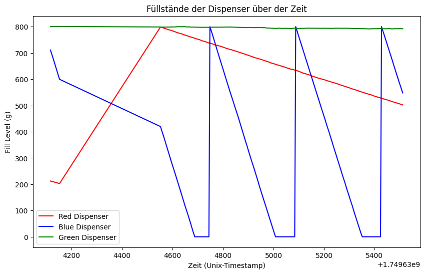

# Bericht: Datenspeicherung & Visualisierung – IoT Teaching Factory

## Vorgehen

- Die Daten werden über MQTT unter dem Topic `iot1/teaching_factory` empfangen und verarbeitet.
- Zur Speicherung wird eine **CSV-Datei** (`bottle_data.csv`) als Datenbank genutzt. Die Speicherung erfolgt über Python-Skripte, die alle relevanten Topics (Füllstände, Vibration, Temperatur, Status) vollständig und korrekt ablegen.
- Für die Visualisierung wurde ein Python-Programm (`visualisierung.ipynb`) erstellt, das beliebige Zeitreihen aus der CSV-Datei einliest und grafisch darstellt.
- Es wurden mindestens 15 Minuten an Daten gespeichert.

## Beispiel: Visualisierung einer Zeitreihe

Die folgende Abbildung zeigt den Verlauf des Füllstands des roten Dispensers über die Zeit:

## Umgesetzte Anforderungen

- ✅ Einfache Lösung mit CSV-Datei als Datenbank (`bottle_data.csv`)
- ✅ Daten aller relevanten Topics werden vollständig und korrekt gespeichert
- ✅ Python-Programm zur Visualisierung (`visualisierung.ipynb`)
- ✅ Report enthält einen Plot einer ausgewählten Zeitreihe
- ✅ Mindestens 15 Minuten Daten gespeichert

## Erweiterungen

- ✅ Datenbank auch als TinyDB realisiert (`bottle_db.py`)
- ✅ Plotly für interaktive Plots in `visualisierung.ipynb` genutzt
- [ ] System konfigurierbar per config-Datei
- [ ] Fehlerbehandlung bei Verbindungsabbruch zum MQTT-Server
- [ ] REST-API oder SQL-Abfragen für externe Systeme

## Hinweise

- Die Daten können mit Pandas weiterverarbeitet werden.
- Die Visualisierung kann einfach angepasst werden, um andere Zeitreihen darzustellen.
- Für weiterführende Analysen stehen die gespeicherten Daten zur Verfügung.
---
